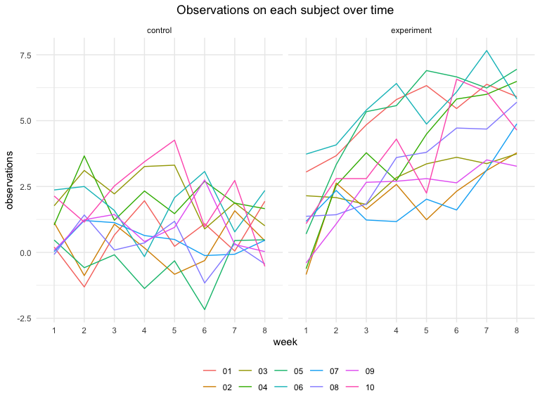

p8105\_hw5\_xj2249
================
xj2249
10/31/2019

# Problem1

``` r
iris_with_missing <-
        iris %>% 
        map_df(~replace(.x, sample(1:150, 20), NA)) %>%
        mutate(Species = as.character(Species))

# write a function
replace_missing <- function(vector) {
        
        if (is.numeric(vector)) {
                replace_na(vector,mean(vector,na.rm = TRUE))
        } else if (is.character(vector)) {
                replace_na(vector,"virginica")
        } else  {
                stop("Error: neither numeric nor character")
        }
}
# apply my 'replace_missing' function
iris_with_missing %>% 
        map(replace_missing) %>% 
        bind_cols() 
```

    ## # A tibble: 150 x 5
    ##    Sepal.Length Sepal.Width Petal.Length Petal.Width Species
    ##           <dbl>       <dbl>        <dbl>       <dbl> <chr>  
    ##  1         5.1          3.5         1.4         0.2  setosa 
    ##  2         4.9          3           1.4         0.2  setosa 
    ##  3         4.7          3.2         1.3         0.2  setosa 
    ##  4         4.6          3.1         1.5         1.19 setosa 
    ##  5         5            3.6         1.4         0.2  setosa 
    ##  6         5.4          3.9         1.7         0.4  setosa 
    ##  7         5.82         3.4         1.4         0.3  setosa 
    ##  8         5            3.4         1.5         0.2  setosa 
    ##  9         4.4          2.9         1.4         0.2  setosa 
    ## 10         4.9          3.1         3.77        0.1  setosa 
    ## # … with 140 more rows

# Problem2

``` r
study_df <- 
        tibble(file_names = list.files("./data"),
               path = str_c("./data/", file_names)) %>%
        mutate(data = map(path, read_csv)) %>% 
        unnest(data) %>% 
        select(-path) %>% 
        pivot_longer(
                -file_names,
                names_to = "week",
                names_prefix = "week_",
                values_to = "observations"
                ) %>% 
        separate(file_names,into = c("group","id"), sep = "_") %>% 
        mutate(
                id = str_remove(id,".csv"),
                week = factor(week)) 
head(study_df) %>% knitr::kable()
```

| group | id | week | observations |
| :---- | :- | :--- | -----------: |
| con   | 01 | 1    |         0.20 |
| con   | 01 | 2    |       \-1.31 |
| con   | 01 | 3    |         0.66 |
| con   | 01 | 4    |         1.96 |
| con   | 01 | 5    |         0.23 |
| con   | 01 | 6    |         1.09 |

## Spaghetti plot

``` r
study_df %>% 
        ggplot(aes(x = week, y = observations)) +
        geom_line(aes(group = id,color = id)) +
        facet_grid(.~ group,labeller = as_labeller(c("con" =  "control", "exp" = "experiment"))) +
        labs(title = "Observations on each subject over time") 
```



As we can see, firstly, experiment group has higher observations
overally, compared with control group. Secondly, two groups manifest a
different temporal trend. in control group, there’s a fluctuation of
obsevations over time, while in experiment group, observations show an
increased trend with time passing by.

# Problem3

``` r
lm_regression <- function(n = 30, beta0 = 2, beta1 = 0 ){
        sim_df = tibble(
                x = rnorm(n),
                y = beta0 + beta1*x + rnorm(n,0,sqrt(50))
                )
        ls_fit = lm(y ~ x , data = sim_df)
        
        tibble(
                beta1_hat = coef(ls_fit)[2],
                p_value = 
                        ls_fit %>% 
                        broom::tidy() %>% 
                        filter(term == "x") %>% 
                        pull(p.value)
                )
}
```

``` r
sim_results <-
        tibble(beta1 = c(0,1,2,3,4,5,6)) %>% 
        mutate(
                output = map( .x = beta1, ~rerun(10000,lm_regression(beta1 = .x ))),
                output = map(output,bind_rows)
                ) %>% 
        unnest(output) %>% 
        mutate(beta1 = factor(beta1))
```

## Association between effect size and power

``` r
sim_results %>% 
        filter(beta1 != 0) %>% 
        mutate(reject = case_when(p_value < 0.05 ~ 1,
                                  TRUE ~ 0)) %>% 
        group_by(beta1) %>% 
        summarise(power = mean(reject)) %>% 
        ggplot(aes(x = beta1, y = power, color = beta1)) +
        geom_point() + 
        labs( x = expression(beta[1]),
              title = "Fig1: power under different effect size") +
        theme(legend.position = "none")
```


As the plot shows, with the increase of size effect, the power of test
increases.

## Average estimate of  and true  in all and only null-rejected sample

``` r
null_rejected_df <- 
        sim_results %>% 
        filter(p_value < 0.05) %>% 
        group_by(beta1) %>% 
        summarise(mean_beta1_hat = mean(beta1_hat))

sim_results %>% 
        group_by(beta1) %>% 
        summarise(mean_beta1_hat = mean(beta1_hat)) %>% 
        ggplot(aes(x = beta1, y = mean_beta1_hat)) +
        geom_point(aes( color = "all sample")) +
        geom_point(aes( color = "null-rejected sample"),alpha = 0.8,data = null_rejected_df) + 
        labs( x = expression(beta[1]),
              y = expression(avarage~hat(beta)[1]),
              title = expression(Fig2: average~hat(beta)[1]~and~true~beta[1]~among~all~and~null-rejected~sample)) 
```


The sample average of
 across tests for which the null is rejected get
closer and closer to the true value of

with the  (effect size) increases.

When the effect size is small, the power of test is relatively low and
therefore, to be rejected, a
 need to be further away from null(more extreme) than
the avarage
 or the true
,
which explains why in null-rejected sample, the avarage is higher. And,
with the increase of effect size, as we can see in Fig1, the power of
test increase also, and we can easily detect the difference. Or in other
word, the effect size is large enough itself, so as that
 doesn’t need to be more extreme to be rejected.
